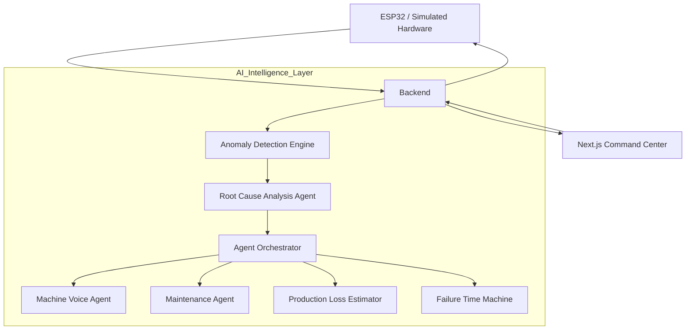

# 🧠 Agentic Digital Twin

> **"Self-Aware, Self-Healing, and Human-Centric Industrial Monitoring."**

[](https://www.python.org/)
[](https://nextjs.org/)
[](https://fastapi.tiangolo.com/)
[](https://opensource.org/licenses/MIT)

Agentic Digital Twin is a production-grade industrial monitoring ecosystem designed for motor-heater subsystems. It combines real-time physics-based simulation with a swarm of AI agents to detect anomalies, quantify production loss, and initiate self-healing protocols before hardware failure occurs.

---

## 🚀 Key Innovations

### 🤖 Neural Agent Swarm

A collaborative network of specialized AI agents working together to monitor, diagnose, predict, and respond to industrial equipment failures in real time.

### ⏳ AI Failure Time Machine

Replay historical events leading up to a failure and simulate future outcomes if corrective actions are ignored, enabling proactive decision-making.

### 🗣 Machine-to-Human Voice

The Digital Twin communicates its condition in natural language, helping operators understand system health without interpreting complex telemetry.

**Example:**

> "I am experiencing increasing thermal stress and reduced motion efficiency. If left unattended, I may enter a critical state within the next few minutes."

### 💰 Business-Aware Maintenance

Converts technical anomalies into measurable business impact by estimating production losses, downtime costs, and maintenance urgency.

---

## 🛠 Tech Stack

| Layer             | Technology                                                     |
| ----------------- | -------------------------------------------------------------- |
| **Frontend**      | Next.js 15, TailwindCSS, Recharts, Framer Motion, Lucide Icons |
| **Backend**       | FastAPI, Python 3.10, SQLAlchemy, SQLite, Pydantic             |
| **Intelligence**  | Google Gemini, Scikit-Learn, Isolation Forest                  |
| **Communication** | WebSockets, REST APIs                                          |
| **Hardware**      | ESP32, Arduino C++, Serial Communication                       |
| **Deployment**    | Docker, Vercel, Linux Servers                                  |

---

## 🏗 System Architecture



---

## 📦 Core Features

### 1️⃣ Neural Command Center

A centralized dashboard for monitoring:

* Motor Position
* Velocity
* Temperature
* Power Consumption
* Predicted vs Actual Behavior
* Real-Time Anomaly Alerts

#### Capabilities

* Live telemetry streaming
* Digital Twin visualization
* AI-generated health insights
* Fault severity classification

---

### 2️⃣ Failure Time Machine

Allows engineers to:

* Replay the last 20 minutes before a fault
* Visualize anomaly progression
* Compare expected and actual machine behavior
* Predict future degradation trajectories

#### Forecast Intervals

* +2 Minutes
* +4 Minutes
* +6 Minutes
* +10 Minutes

---

### 3️⃣ Machine Voice Hub

An interactive conversational interface where operators can communicate directly with the Digital Twin.

#### Example Questions

* What is your current health status?
* Why did temperature increase?
* What component is at risk?
* What maintenance should be performed?

#### Example Response

> "My motor temperature is rising faster than expected. Based on historical patterns, cooling efficiency may be degrading."

---

### 4️⃣ Root Cause Analysis Engine

Automatically identifies probable causes of failures using:

* Sensor drift analysis
* Thermal trend analysis
* Motion deviation patterns
* Historical failure comparisons

#### RCA Output

```json
{
  "fault": "Motor Overheating",
  "confidence": "92%",
  "root_cause": "Cooling Fan Efficiency Loss",
  "severity": "High"
}
```

---

### 5️⃣ Smart Maintenance Center

Automatically generates maintenance recommendations and tickets.

#### Features

* AI-generated maintenance reports
* Predictive maintenance scheduling
* Severity-based prioritization
* Automated ticket creation

---

### 6️⃣ Production Loss Estimator

Translates equipment degradation into business metrics.

#### Metrics

* Downtime Cost
* Revenue Impact
* Maintenance ROI
* Urgency Score

Example:

```text
Current Production Loss:
$43/minute

Estimated Loss After 10 Minutes:
$430
```

---

### 7️⃣ Self-Healing Framework

When safe and possible, the system can automatically:

* Reduce operational load
* Adjust control parameters
* Trigger cooling mechanisms
* Reset affected subsystems
* Notify operators

---

## 🔄 Agent Workflow

```text
Telemetry Stream
        ↓
Anomaly Detection Agent
        ↓
Root Cause Analysis Agent
        ↓
Agent Orchestrator
        ↓
 ┌─────────────────────┐
 │ Voice Agent         │
 │ Maintenance Agent   │
 │ Loss Estimator      │
 │ Time Machine Agent  │
 └─────────────────────┘
        ↓
Dashboard + Alerts + Actions
```

---

## 🚦 Getting Started

### Backend Setup

```bash
cd backend

python -m venv venv

# Windows
venv\Scripts\activate

# Linux / Mac
source venv/bin/activate

pip install -r requirements.txt

python run.py
```

Backend runs at:

```text
http://localhost:8000
```

---

### Frontend Setup

```bash
cd frontend

npm install

npm run dev
```

Frontend runs at:

```text
http://localhost:3000
```

---

### Simulation Mode

No hardware is required.

The system automatically launches a high-fidelity industrial simulation.

Inject faults using:

```bash
python backend/scripts/test_self_healing.py
```

Available fault scenarios:

* Overheating
* Position Drift
* Sensor Failure
* Bearing Wear
* Power Instability

---

## 📊 Sample Telemetry

```json
{
  "timestamp": "2026-05-31T12:00:00",
  "temperature": 87.5,
  "velocity": 1240,
  "position": 52.1,
  "anomaly_score": 0.91,
  "health_score": 72
}
```

---

## 🎯 Industrial Use Cases

### Manufacturing

* Conveyor systems
* Packaging lines
* CNC machines

### Energy

* Pumps
* Turbines
* Cooling systems

### Smart Factories

* Industry 4.0 monitoring
* Predictive maintenance
* Asset optimization

### Automotive

* Robotic assembly lines
* Motor diagnostics
* Thermal monitoring

---

## 📈 Expected Impact

| Metric                 | Improvement                |
| ---------------------- | -------------------------- |
| Downtime Reduction     | ~35%                       |
| Fault Detection Speed  | Real-Time                  |
| RCA Time               | Seconds Instead of Minutes |
| Maintenance Efficiency | +40%                       |
| Operator Training Time | Reduced Significantly      |

---

## 🔒 Security

* Secure WebSocket Communication
* Role-Based Access Control
* Audit Logging
* Encrypted Telemetry Streams
* API Authentication

---

## 🛣 Future Roadmap

### Phase 1

* Core Digital Twin
* Real-Time Monitoring
* AI Agents

### Phase 2

* Multi-Machine Support
* Edge AI Deployment
* Advanced Forecasting

### Phase 3

* Autonomous Maintenance
* Reinforcement Learning Agents
* Industrial ERP Integration

---

## 👨‍💻 Team Vision

Building the next generation of industrial intelligence where machines are no longer passive assets but active, self-aware participants capable of explaining, predicting, and improving their own performance.

---

## 📜 License

MIT License

Copyright (c) 2026

Permission is hereby granted, free of charge, to any person obtaining a copy of this software and associated documentation files to deal in the Software without restriction.
